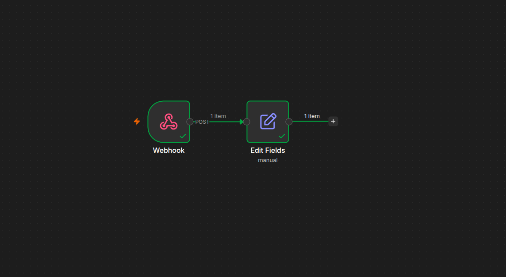
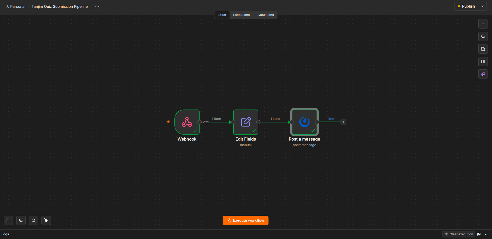
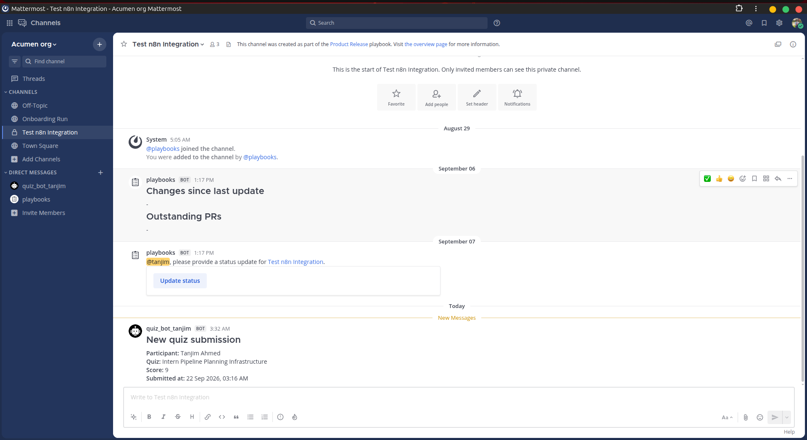

# Intern Pipeline Planning

A Baserow-based intern quiz submission pipeline integrated with n8n for automated data processing and Mattermost notifications.

## 📌 Project Overview

The Intern Pipeline Planning project focuses on building and validating the core intern quiz submission pipeline.

The pipeline is now fully implemented and validated end to end, from Baserow submission through to the final Mattermost notification.

### End-to-End Flow

```
Baserow Form
     ↓
Baserow Table
     ↓
n8n Trigger
     ↓
Field Mapping
     ↓
Dhaka Time Conversion
     ↓
Mattermost Notification
```

## 🎯 Current Scope

The current implementation focuses on the submission pipeline rather than creating departmental quiz questions.

### Implemented

- Baserow Quiz Submissions table
- Baserow submission form
- Participant field
- Quiz Name field
- Score field
- Automatic submission timestamp
- Baserow → n8n integration
- n8n field mapping
- Dhaka timezone conversion
- Mattermost notification via dedicated bot account
- End-to-end pipeline testing (live, production webhook)

## 🗂️ Baserow Setup

A dedicated Quiz Submissions table was created in Baserow to receive quiz submission data.

### Table Fields

| Field | Purpose |
|---|---|
| Participant | Stores the participant name |
| Quiz Name | Identifies the submitted quiz |
| Score | Stores the submitted score |
| Submitted At | Automatically records the submission timestamp |

The table is connected to the Baserow form so that every form submission creates a new row.

## 📝 Baserow Form

The Baserow form provides the submission interface for quiz data.

### Form Fields

- Participant
- Quiz Name
- Score
- Submitted At

**Baserow Pipeline**


## ⚙️ n8n Automation

The Baserow table is connected to an n8n workflow.

When a new row is created in Baserow, the n8n workflow receives the submission data, maps the required fields, converts the timestamp, and posts a notification to Mattermost.

**n8n Pipeline**


## 🔄 Data Processing

The following fields are received from Baserow and mapped inside n8n:

- Participant
- Quiz Name
- Score
- Submitted At

The Submitted At timestamp is converted to Dhaka Time (UTC+6) before the notification stage.

## 🔗 Automation Flow

```
┌─────────────────────────┐
│      Baserow Form       │
│                         │
│ Participant             │
│ Quiz Name               │
│ Score                   │
└────────────┬────────────┘
             │
             ▼
┌─────────────────────────┐
│     Baserow Table       │
│   Quiz Submissions      │
└────────────┬────────────┘
             │
             │ Row Created
             ▼
┌─────────────────────────┐
│          n8n            │
│                         │
│ Trigger                 │
│ Field Mapping           │
│ Time Conversion         │
└────────────┬────────────┘
             │
             ▼
┌─────────────────────────┐
│       Mattermost        │
│      Notification       │
└─────────────────────────┘
```

## 💬 Mattermost Notification

The final stage of the pipeline sends the processed quiz submission information to the approved Mattermost channel via a dedicated bot account (`quiz_bot_tanjim`).

Sample notification:

```
### New quiz submission
**Participant:** Tanjim Ahmed
**Quiz:** Intern Pipeline Planning Infrastructure
**Score:** 9
**Submitted at:** 22 Sep 2026, 03:16 AM
```

**Mattermost Notification**


## 🧪 Testing

The pipeline was tested using real Baserow form submissions, running live against the production webhook.

### Validation Checklist

- [x] Baserow table created
- [x] Baserow form created
- [x] Form submission tested
- [x] Baserow row creation verified
- [x] n8n integration configured
- [x] Baserow data received by n8n
- [x] Field mapping configured
- [x] Dhaka timezone conversion configured
- [x] Mattermost notification node prepared
- [x] Final Mattermost notification execution

## 📁 Project Structure

```
intern-pipeline-planning/
│
├── screenshots/
│   ├── baserow-pipeline.png
│   ├── n8n-final-workflow.png
│   ├── mattermost-notification.png
│   └── playbook-status-update.png
│
└── README.md
```

## 🛠️ Technologies Used

| Technology | Purpose |
|---|---|
| Baserow | Form and submission data management |
| n8n | Workflow automation and data processing |
| Mattermost | Notification and communication |
| Git | Version control |
| GitHub | Repository and project documentation |

## 🔐 Security

No passwords, API keys, access tokens, or other sensitive credentials are stored in this repository.

Credentials are managed through the appropriate n8n credential configuration.

## 📊 Project Status

| Component | Status |
|---|---|
| Baserow Table | ✅ Completed |
| Baserow Form | ✅ Completed |
| Form Testing | ✅ Completed |
| Baserow → n8n Integration | ✅ Completed |
| Field Mapping | ✅ Completed |
| Dhaka Time Conversion | ✅ Completed |
| Mattermost Node | ✅ Completed |
| Final Mattermost Notification | ✅ Completed |

## 🚀 Next Step

The core demo pipeline is complete and validated end to end. The next step is to apply the same pipeline pattern to each department's Intern Quiz submission form.

## 👨‍💻 Author

**Tanjim Ahmed**
DevOps Intern
Skills: Linux • Docker • Git/GitHub • CI/CD • Jenkins • Kubernetes • AWS • Terraform • Cloud & Automation

## 📌 Project Status

Core submission pipeline implemented and fully tested end to end.

The workflow successfully demonstrates:

```
Baserow
   ↓
n8n
   ↓
Data Processing
   ↓
Mattermost Notification (Live)
```

The pipeline is complete and ready to be replicated for each Intern Quiz form.
