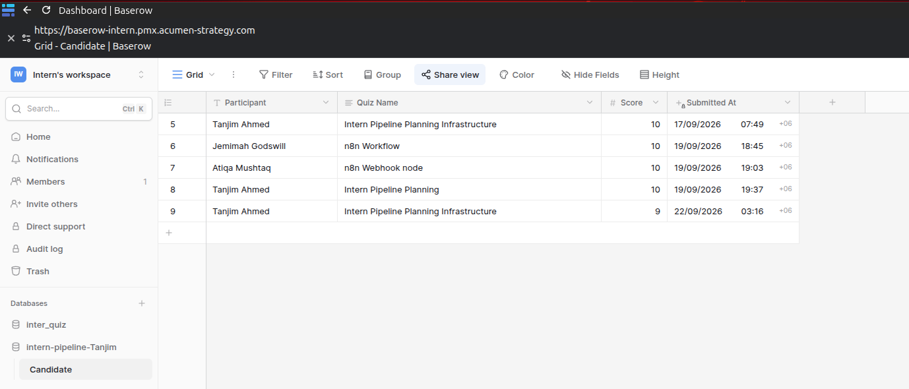
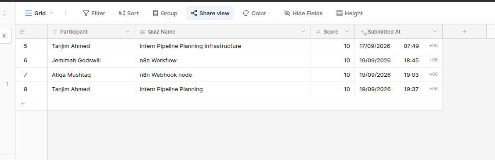

# Intern Pipeline Planning

A Baserow-based intern quiz submission pipeline integrated with **n8n** for automated data processing and **Mattermost** notifications.

---

## 📌 Project Overview

The **Intern Pipeline Planning** project is part of the intern onboarding and submission automation workflow.

The current implementation focuses on building and validating the core submission pipeline:

```text
Baserow Form
     ↓
Baserow Table
     ↓
n8n Webhook
     ↓
Field Mapping
     ↓
Mattermost Notification
```

The goal is to ensure that quiz submission data can move reliably from Baserow into n8n, be processed and mapped correctly, and then be delivered to Mattermost.

---

## 🎯 Current Scope

The current implementation covers:

* Baserow quiz submission table
* Baserow form
* Automatic submission timestamp
* Baserow → n8n webhook integration
* n8n field mapping
* Timestamp conversion to Dhaka time
* Mattermost notification preparation
* End-to-end pipeline testing

> **Note:** Quiz questions and departmental quiz creation are not part of the current implementation scope. The focus is on validating the submission pipeline.

---

## 🗂️ Baserow Setup

A dedicated **Quiz Submissions** table was created in Baserow.

### Fields

| Field        | Type      | Purpose                               |
| ------------ | --------- | ------------------------------------- |
| Participant  | Text      | Stores the participant name           |
| Quiz Name    | Text      | Identifies the submitted quiz         |
| Score        | Number    | Stores the quiz score                 |
| Submitted At | Date/Time | Automatically records submission time |

No unnecessary fields were added to keep the pipeline simple and focused on the required submission data.

---

## 📝 Baserow Form

The Baserow form is used as the submission interface.

### Form Fields

* Participant
* Quiz Name
* Score
* Submitted At

When a form is submitted, a new row is created in the Baserow table.

### Form Screenshot



---

## 🗃️ Baserow Table

The submitted form data is stored directly in the Baserow **Quiz Submissions** table.

### Table Screenshot


---

## ⚙️ n8n Integration

The Baserow table is connected to an n8n workflow using the **Baserow Rows Created** trigger.

### Workflow

```text
Baserow
   │
   │ New Row Created
   ▼
n8n Webhook / Trigger
   │
   ▼
Field Mapping
   │
   ▼
Dhaka Time Conversion
   │
   ▼
Mattermost Notification
```

---

## 🔗 Webhook Integration

The n8n workflow receives newly created Baserow rows automatically.

The webhook/trigger was tested using real Baserow form submissions, and the submitted data was successfully received by n8n.

### n8n Webhook Screenshot


---

## 🔄 Field Mapping

The received Baserow data is mapped into the required fields:

```text
Participant
Quiz Name
Score
Submitted At
```

The `Submitted At` timestamp is converted to **Dhaka time (UTC+6)** before further processing.

### Field Mapping Screenshot


---

## 💬 Mattermost Notification

The final stage of the pipeline is the Mattermost notification.

The workflow is prepared to send the processed quiz submission information to the configured Mattermost channel.

Expected notification structure:

```text
New Quiz Submission

Participant: <participant>
Quiz: <quiz name>
Score: <score>
Submitted At: <Dhaka time>
```

### Mattermost Screenshot


---

## 🧪 Testing

The pipeline was tested using actual Baserow form submissions.

### Validation Checklist

* [x] Baserow table created
* [x] Baserow form created
* [x] Form submission tested
* [x] Baserow row creation verified
* [x] n8n trigger connected
* [x] Data received successfully in n8n
* [x] Field mapping configured
* [x] Submitted timestamp converted to Dhaka time
* [x] Mattermost notification node prepared
* [ ] Final Mattermost notification execution pending approved credential/channel confirmation

---

## 📸 Implementation Evidence

### Baserow Setup

The Baserow quiz submission table and form were created and tested successfully.


### n8n Integration

The Baserow submission data is successfully received and processed through the n8n workflow.



## 📁 Project Structure

```text
intern-pipeline-planning/
│
├── screenshots/
│   ├── baserow-form.png
│   ├── baserow-table.png
│   ├── n8n-webhook.png
│   ├── n8n-field-mapping.png
│   └── mattermost-notification.png
│
└── README.md
```

---

## 🔧 Technologies Used

| Technology | Purpose                                 |
| ---------- | --------------------------------------- |
| Baserow    | Form and submission data management     |
| n8n        | Workflow automation and data processing |
| Mattermost | Notification and communication          |
| Git        | Version control                         |
| GitHub     | Project documentation and evidence      |

---

## 🔐 Security & Credentials

No credentials, tokens, passwords, or sensitive configuration values are stored in this repository.

Credentials are managed through the appropriate n8n credential system.

---

## 🚀 End-to-End Flow

```text
┌──────────────────────┐
│    Baserow Form      │
│                      │
│ Participant          │
│ Quiz Name            │
│ Score                │
└──────────┬───────────┘
           │
           ▼
┌──────────────────────┐
│   Baserow Table      │
│   Quiz Submissions   │
└──────────┬───────────┘
           │
           │ Row Created
           ▼
┌──────────────────────┐
│        n8n           │
│                      │
│ Trigger              │
│ Field Mapping        │
│ Time Conversion      │
└──────────┬───────────┘
           │
           ▼
┌──────────────────────┐
│     Mattermost       │
│    Notification      │
└──────────────────────┘
```

---

## 📊 Project Status

| Component              | Status                                     |
| ---------------------- | ------------------------------------------ |
| Baserow Table          | ✅ Completed                                |
| Baserow Form           | ✅ Completed                                |
| Form Testing           | ✅ Completed                                |
| n8n Integration        | ✅ Completed                                |
| Field Mapping          | ✅ Completed                                |
| Dhaka Time Conversion  | ✅ Completed                                |
| Mattermost Node        | 🟡 Prepared                                |
| Final E2E Notification | 🟡 Pending Credential/Channel Confirmation |

---

## 🔗 Project Resources

* **GitHub Repository:** `intern-pipeline-planning`
* **Baserow:** Intern Pipeline Planning / Quiz Submissions
* **Automation:** n8n Intern Pipeline Planning workflow
* **Notification:** Mattermost

---

## 👨‍💻 Author

**Tanjim Ahmed**

DevOps Intern
Linux | Docker | CI/CD | Git/GitHub | Jenkins | Kubernetes | AWS | Terraform | Cloud & Automation

---

## 📌 Project Status

**Current Status:** Core Baserow → n8n submission pipeline implemented and tested.

The remaining step is to validate the final Mattermost notification using the approved credential and destination channel.

