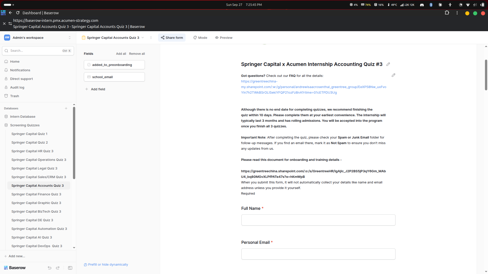
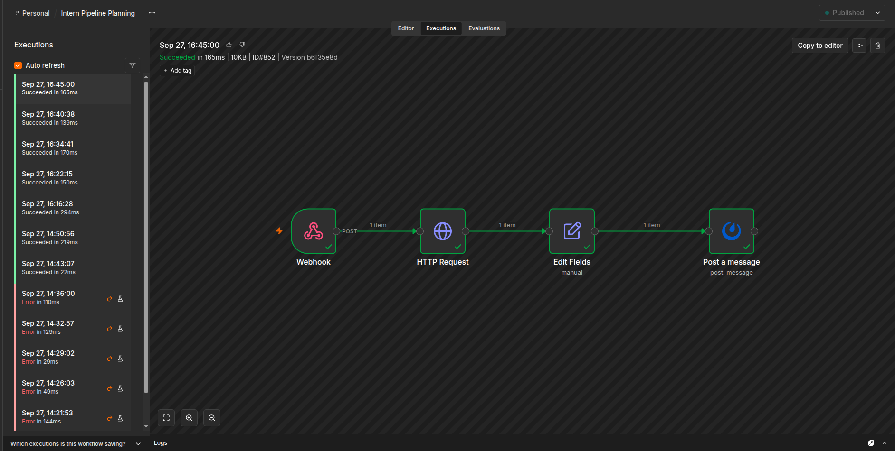
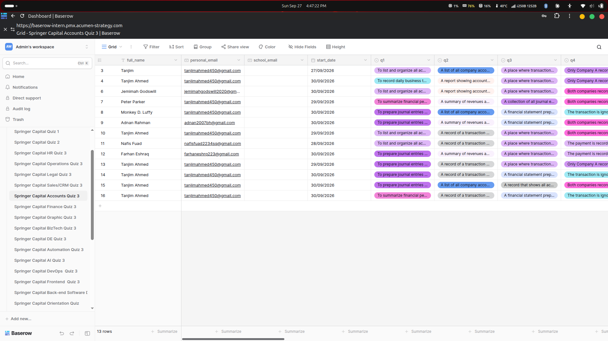
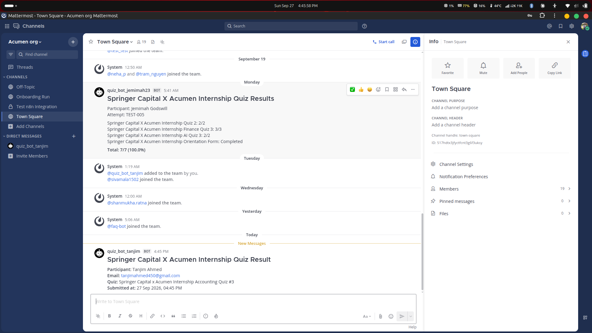

# Intern Pipeline Planning — Accounting Quiz Automation

A Baserow-based intern quiz submission pipeline integrated with n8n for automated scoring and Mattermost notifications, built for **Springer Capital's Accounts Quiz 3**.

> Looking for the earlier generic proof-of-concept version (before per-question scoring existed)? See [demo-quiz/README.md](demo-quiz/README.md).

## 📌 Project Overview

This pipeline takes a real quiz submission from Baserow, automatically grades the multiple-choice answers, and posts a formatted result to Mattermost — no manual scoring or copy-pasting required.

It builds on the pattern proven in the demo pipeline, but adds the piece the demo didn't need: **calculating a score from 23 raw answers** instead of reading a single pre-filled `Score` field.

## 📝 Baserow Form

Form: *Springer Capital x Acumen Internship Accounting Quiz #3*

**Fields collected**
- Full Name
- Personal Email
- Planned internship start date
- `q1`–`q19` — multiple choice accounting questions (Chart of Accounts, journal entries, general ledger, COA classification, TransactID formatting, etc.)
- `q20` — multiple choice, tied to the company's internal practice spreadsheet
- `q21` — multi-part written question (specific transaction walkthrough)
- `q22` — open text ("what columns should you be left with after cleanup")
- `q23` — final assessment screenshot/link submission
- `added_to_preonboarding`, `school_email` — internal tracking fields

## ⚙️ How It Works

Baserow (rows.created webhook, table: Springer Capital Accounts Quiz 3)
│
▼
n8n Webhook node
│
▼
Code node ── accounting-quiz/score-accounts-quiz3.js
│ (grades MCQ answers against an answer key,
│ computes score + percentage, builds message text)
▼
Edit Fields node (maps final fields for the message)
│
▼
Post a message node ── Mattermost (bot: quiz_bot_tanjim)

## 🧮 Scoring Logic

`q1`–`q19` are graded automatically: each submitted answer is compared against a hard-coded answer key inside an n8n Code node, and the result is turned into `score/total` plus a percentage.

`q20`–`q23` are **not auto-graded**:
- `q20` depends on the internal practice spreadsheet (answer not yet confirmed).
- `q21`–`q23` are open-ended or file-based, so the script just flags `needs_manual_review: true` for these and leaves them for a human to check.

## 💬 Mattermost Notification

Final formatted message posted by `quiz_bot_tanjim`:

New Quiz Submission
Participant: <full name>
Quiz: Springer Capital Accounts Quiz 3
Score: <correct>/<total> (<percentage>%)
Submitted at: <timestamp>
Note: q21–q23 are open-ended and need manual review.

## 📁 What's in `accounting-quiz/`

| File | Purpose |
|---|---|
| `score-accounts-quiz3.js` | n8n Code node script — grades `q1`–`q19`, computes score + percentage, builds the Mattermost message text |
| `answer-key-notes.md` | Where the 23 questions came from, which are auto-gradable, and which need manual review |
| `screenshots/` | Screenshots of this pipeline in action |

## 🚀 Setup in n8n

1. Build the workflow: **Webhook → Code → Edit Fields → Post a message**.
2. Paste `accounting-quiz/score-accounts-quiz3.js` into the Code node (mode: *Run Once for Each Item*).
3. In the Post a message node, set the message body to `{{$json.message_text}}`.
4. Test with Baserow's "Test webhook" button — click **Execute workflow** in n8n right before triggering the test, since the test URL only accepts one call per click.
5. Once verified, **Publish** the workflow and swap the Baserow webhook URL from the `webhook-test/...` URL to the production URL.

## ✅ Known TODOs

- [ ] Confirm `q20`'s correct answer against the internal practice spreadsheet (which bank account / company) — see `accounting-quiz/answer-key-notes.md`.
- [ ] Decide how `q21`–`q23` manual reviews get tracked (Baserow status field? Separate checklist?).
- [ ] Double-check the exact text Baserow stores for each MCQ answer matches the `answerKey` strings exactly, using a real test submission.

## 📸 Screenshots

### 1. Quiz Form View
The Baserow form as seen by the intern submitting the quiz.

### 2. n8n Workflow Configuration
The Webhook → Code → Edit Fields → Post a message workflow inside n8n.

### 3. Baserow Grid View
Submitted responses stored in the Baserow table.

### 4. Mattermost Result
The final scored notification posted to Mattermost.

## 📁 Project Structure

intern-pipeline-planning/
│
├── README.md ← this file (Accounting Quiz Automation)
│
├── accounting-quiz/
│ ├── score-accounts-quiz3.js
│ ├── answer-key-notes.md
│ └── screenshots/
│ ├── 00-baserow-grid-view.png
│ ├── 01-quiz-form-view.png
│ ├── 02-n8n-workflow-config.png
│ └── 03-mattermost-result.png
│
└── demo-quiz/ ← earlier generic proof-of-concept pipeline
├── README.md
└── screenshots/
├── baserow-form.png
├── n8n-final-workflow.png
└── mattermost-notification.png

## 🛠️ Technologies Used

| Technology | Purpose |
|---|---|
| Baserow | Form and submission data management |
| n8n | Workflow automation and data processing |
| Mattermost | Notification and communication |
| Git | Version control |
| GitHub | Repository and project documentation |

## 🔐 Security

No passwords, API keys, access tokens, or other sensitive credentials are stored in this repository. Credentials are managed through the appropriate n8n credential configuration.

## 📊 Project Status

| Component | Status |
|---|---|
| Answer key (q1–q19) | ✅ Completed |
| Answer key (q20) | ⏳ Pending internal doc confirmation |
| Manual review flow (q21–q23) | ✅ Flagged in output |
| n8n workflow build | ✅ Completed |
| Live production test | ✅ Completed |

## 🔜 Next Step

Confirm `q20`'s answer, then repeat the same pattern for each remaining department quiz.

## 👨‍💻 Author

Tanjim Ahmed
DevOps Intern
Skills: Linux • Docker • Git/GitHub • CI/CD • Jenkins • Kubernetes • AWS • Terraform • Cloud & Automation
