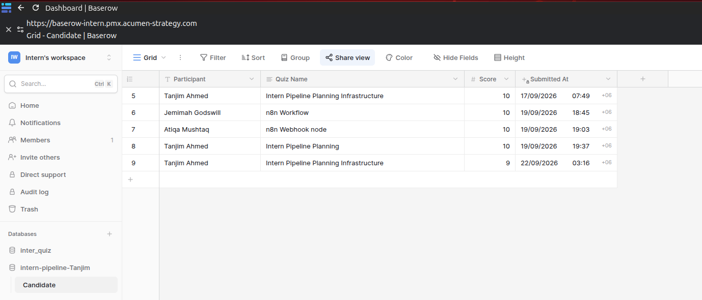
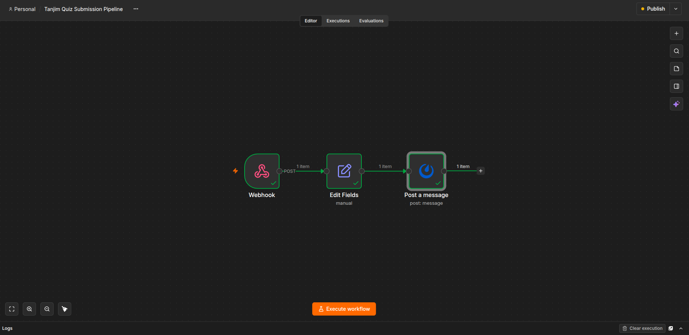
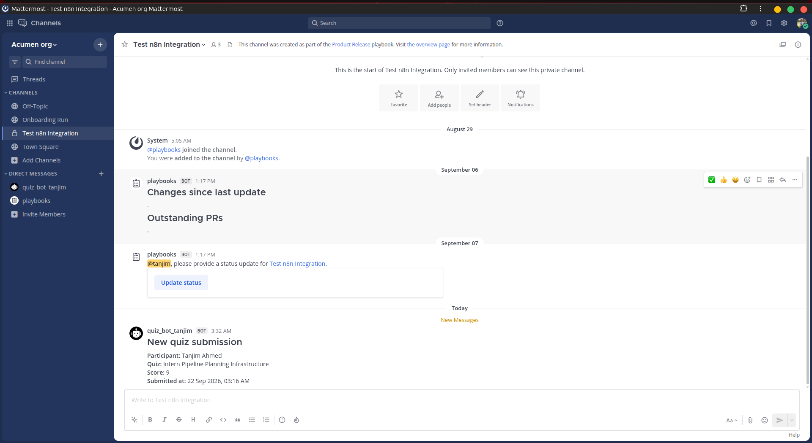

# Demo — Generic Pipeline (Initial Proof of Concept)

This was the first pass at the pipeline: confirm Baserow → n8n → Mattermost
works end to end, using a generic `Participant / Quiz Name / Score /
Submitted At` table — before any per-question scoring logic existed.

See the main [README.md](README.md) for the current, real implementation
(Springer Capital Accounts Quiz 3).

## Flow

```
Baserow Form → Baserow Table → n8n Trigger → Field Mapping → Dhaka Time Conversion → Mattermost Notification
```

## Implemented

- Baserow Quiz Submissions table (Participant, Quiz Name, Score, Submitted At)
- Baserow → n8n webhook integration
- Field mapping + Dhaka timezone (UTC+6) conversion
- Mattermost notification via bot account `quiz_bot_tanjim`
- End-to-end tested against the live production webhook

## Sample notification

```
### New quiz submission
**Participant:** Tanjim Ahmed
**Quiz:** Intern Pipeline Planning Infrastructure
**Score:** 9
**Submitted at:** 22 Sep 2026, 03:16 AM
```

## Screenshots





## Status

| Component | Status |
|---|---|
| Baserow Table | ✅ Completed |
| Baserow Form | ✅ Completed |
| Baserow → n8n Integration | ✅ Completed |
| Mattermost Notification | ✅ Completed |
